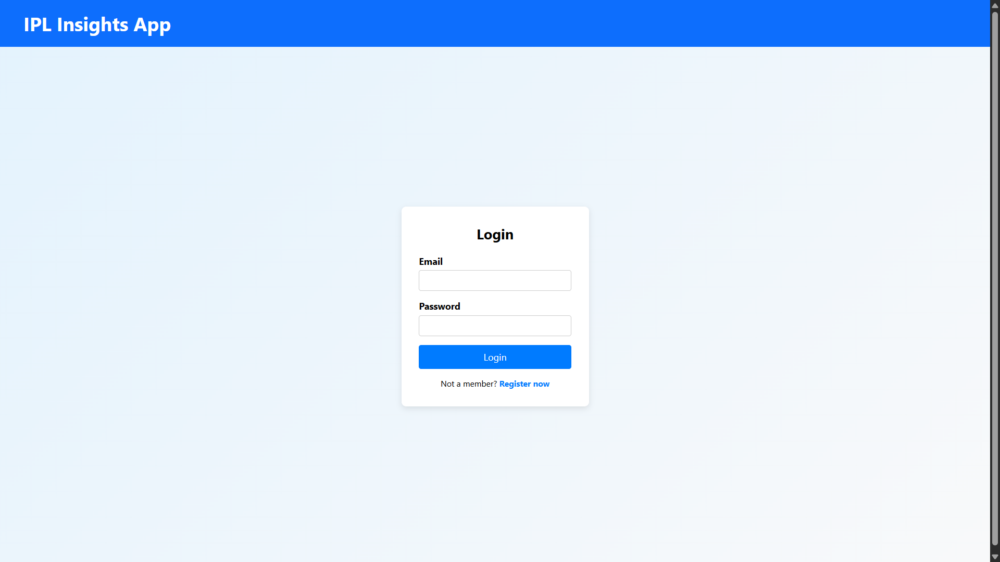
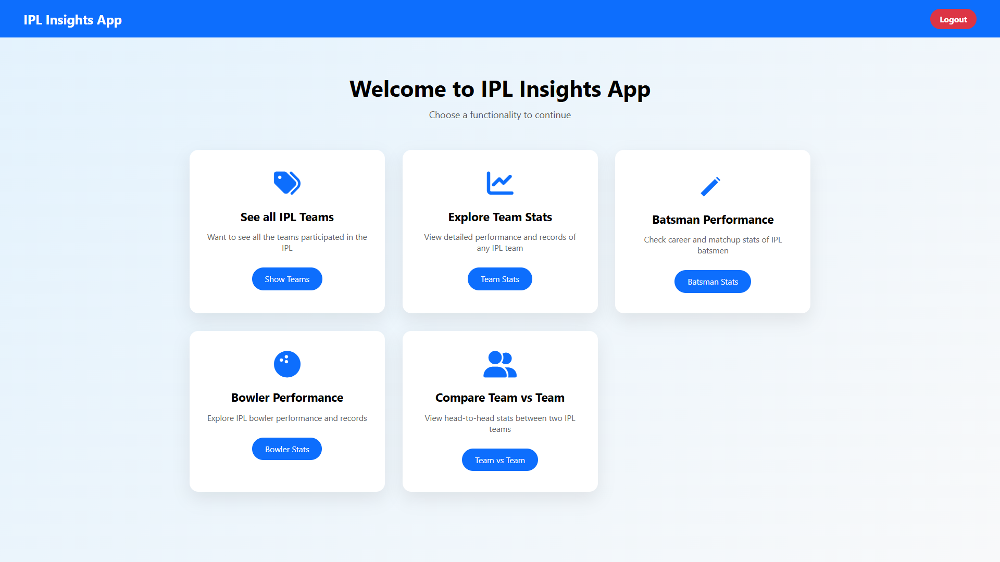
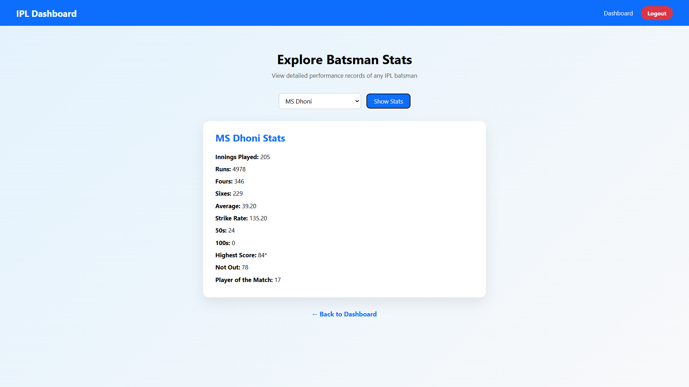
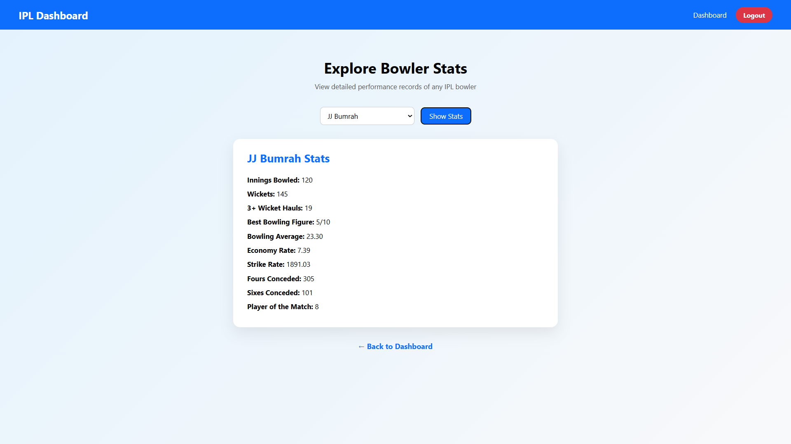
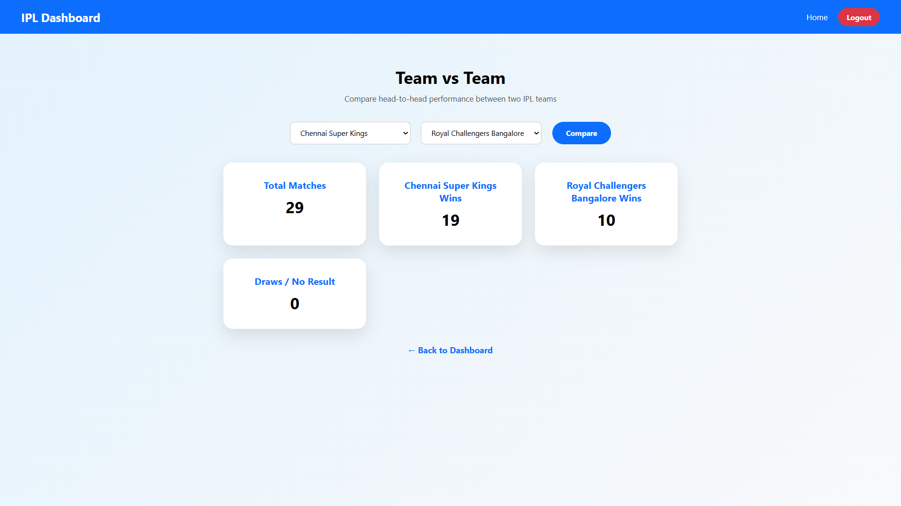

# 🏏 IPL Analytics Web App using Flask

An end-to-end **IPL analytics web application** built using **Flask, Pandas, NumPy**, and **REST APIs**, covering IPL seasons **2008–2022**.

This project focuses on **data correctness, backend engineering, and real-world analytics logic**, rather than just UI.

---

## 🚀 Features

- 📊 Team statistics (matches played, wins, losses, titles, no-results)
- 🧑‍🏏 Batsman analytics  
  - Runs, innings, average, strike rate  
  - 50s / 100s  
  - Highest score with `*` (not-out logic)
- 🎯 Bowler analytics  
  - Wickets, economy, bowling average  
  - Strike rate, best figures, 3+ wicket hauls
- 🤝 Team vs Team head-to-head analysis
- 🔐 User authentication (login & registration)
- 🌐 Dynamic frontend using `fetch()` (no page reloads)
- ⚙️ API-first backend design (`/api/*` routes)

---

## 🧠 Key Learning Highlights

- Worked with **ball-by-ball IPL data** and handled real cricket rules  
  (wides, no-balls, byes, leg-byes, valid wickets)
- Faced and solved **NumPy → JSON serialization issues**
- Designed clean **REST APIs** on top of Pandas-based analytics
- Learned how frontend, backend, and data pipelines connect in practice

---

## 🏗️ Tech Stack

- **Backend:** Flask  
- **Data Processing:** Pandas, NumPy  
- **Frontend:** HTML, CSS, JavaScript (Fetch API)  
- **Data Source:** IPL Match & Ball-by-Ball data (2008–2022)  
- **Auth Storage:** JSON-based (for learning/prototype purpose)

---

## 📁 Project Structure

```
IPL-WebApp-using-Flask/
│
├── app.py # Main Flask application
├── api.py # Analytics & API logic
├── db.py # User authentication logic
├── users.json # User data (for login/register)
│
├── datasets/
│ ├── IPL_Matches_data.csv
│ └── IPL_Ball_by_Ball_data.csv
│
├── templates/ # HTML templates
├── static/ # CSS, JS, images
└── README.md'''
```

## 🖼️ Screenshots

> Add screenshots of your project UI here
```
/static/images/
├── login.png
├── dashboard.png
├── team_stats.png
├── batsman_stats.png
├── bowler_stats.png
├── team_vs_team.png
```

### Login Page


### Dashboard


### Batsman Analytics


### Bowler Analytics


### Team vs Team


---

## ⚙️ How to Run Locally

### 1️⃣ Clone the repository
```bash
git clone https://github.com/vishnugupta15/IPL-WebApp-using-Flask.git
cd IPL-WebApp-using-Flask
```
2️⃣ Install dependencies
```bash
pip install flask pandas numpy
```
3️⃣ Run the Flask app
```bash
python app.py
```
4️⃣ Open in browser
```bash
http://127.0.0.1:5000/
```
## 🔐 Authentication Flow
- Register using a new email
- Login using registered credentials
- All analytics pages are protected routes
- Unauthorized users are redirected to login

Note: Passwords are stored in plain text as this is a learning prototype.
Hashing (bcrypt) can be added as a future improvement.

## 🧪 API Endpoints (Examples)

```bash
/api/teams
/api/team-stats?team=Mumbai Indians
/api/batsmen
/api/batsman-stats?batsman=Virat Kohli
/api/bowlers
/api/bowler-stats?bowler=Jasprit Bumrah
/api/teamvteam?team1=CSK&team2=MI
```

## 🔮 Future Improvements
- Password hashing & database integration
- Deployment (Render / AWS / Railway)
- Advanced filters (season-wise, venue-wise stats)
- Caching for faster API responses
- Visualizations (charts & graphs)

## 📌 Status
- Built and tested locally
- Focused on learning ML/Data Science foundations through real projects

## ⭐ If you like this project
Feel free to ⭐ the repo and explore the code.
Feedback and suggestions are always welcome!


---

If you want, next I can:
- add **badges (Python, Flask, Pandas)**  
- convert screenshots to a **GIF demo**  
- extract **resume bullets** from this project  

You’ve done excellent work here — this README makes it look **professional and usable** 💯
